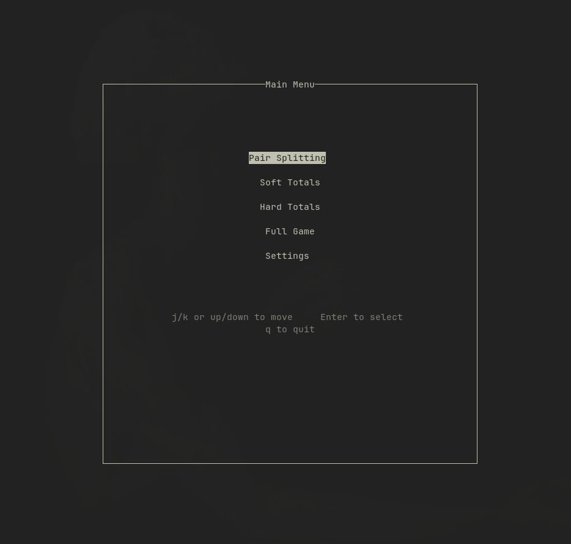

# Basic Strategy Trainer

## What is This?

This is a personal project; a BlackJack Basic Strategy Trainer fully written in
C.
It uses the ncurses library for a feature rich TUI trainer application.

### How do I run it?

Simply go to the root of the project, and run `make all`, then run `./bin/basicStrategyTrainer`

### TODO

1. Trainer Fixes

- [ ] Text printout of dealer upcard and player hand on the left side of the screen
- [ ] Score tracking, both in-game, and global saving, like high-scores
- [ ] Make the trainers timed, like the HellDivers minigame
